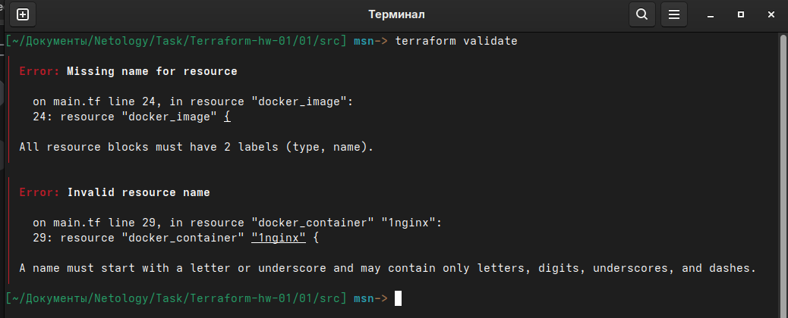
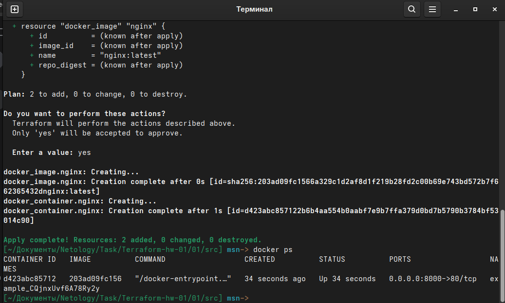

# Отчёт по выполнению домашнего задания «Введение в Terraform»

## Подготовка окружения

### 1. Проверка установки Terraform

Выполнена проверка версии Terraform:

```bash
terraform --version
```


*Версия Terraform: v1.10.5*

### 2. Инициализация проекта

Переход в каталог `01/src` и инициализация Terraform:

```bash
cd 01/src
terraform init
```


## Задание 1

### 1. Изучение файла .gitignore

Согласно файлу `.gitignore`, личную секретную информацию допустимо сохранить в файле `personal.auto.tfvars`:

**Ответ:** Личную секретную информацию можно сохранить в `personal.auto.tfvars`

### 2. Выполнение кода и поиск секрета

Выполняем код проекта:

```bash
terraform apply
```

Находим в state-файле секретное содержимое ресурса `random_password`:


**Ответ:** 
- **Ключ:** `result`
- **Значение:** видно из скрина указанного ключа

### 3. Раскомментирование блока кода и исправление ошибок

Раскомментирован блок кода в `main.tf` (строки 29-42) и выполнена проверка:

```bash
terraform validate
```



**Обнаруженные ошибки:**
1. Отсутствует обязательный аргумент `name` для ресурса `docker_image`
2. Неправильный синтаксис для `docker_container`
3. Ссылка на несуществующий ресурс `random_password.random_string_fake`

**Исправленный фрагмент кода:**

```hcl
resource "docker_image" "nginx" {
  name = "nginx:latest"
}

resource "docker_container" "nginx" {
  image = docker_image.nginx.image_id
  name  = "example_${random_password.random_string.result}"
  
  ports {
    internal = 80
    external = 8000
  }
}
```

### 4. Выполнение исправленного кода

После исправлений выполняем:

```bash
terraform apply
docker ps
```




### 5. Замена имени контейнера и использование auto-approve

Меняем имя контейнера на `hello_world`:

```hcl
resource "docker_container" "nginx" {
  image = docker_image.nginx.image_id
  name  = "hello_world"
  
  ports {
    internal = 80
    external = 8000
  }
}
```

Выполняем с auto-approve:

```bash
terraform apply -auto-approve
docker ps
```


**Объяснение опасности `-auto-approve`:**
Ключ `-auto-approve` пропускает интерактивное подтверждение изменений, что может быть опасно, так как:
- Пользователь не видит планируемых изменений перед применением
- Риск случайного удаления или изменения критических ресурсов
- Невозможность отменить операцию после запуска

**Полезное применение:**
- В CI/CD пайплайнах для автоматизации развертывания
- В скриптах для массового управления инфраструктурой
- При выполнении заранее проверенных и безопасных операций

### 6. Уничтожение ресурсов

Уничтожаем созданные ресурсы:

```bash
terraform destroy -auto-approve
```


**Содержимое `terraform.tfstate` после уничтожения:**

```json
{
  "version": 4,
  "terraform_version": "1.10.5",
  "serial": 11,
  "lineage": "49637562-2f9c-849a-0ac0-233becbb236d",
  "outputs": {},
  "resources": [],
  "check_results": null
}
```

### 7. Почему не удалился docker-образ nginx:latest

В коде используется параметр `keep_locally = true`:

```hcl
resource "docker_image" "nginx" {
  name         = "nginx:latest"
  keep_locally = true    # ← этот параметр предотвращает удаление образа
}
```

**Подтверждение из документации Terraform провайдера docker:**

> `keep_locally` - (Boolean) If true, then the Docker image won't be deleted on destroy operation. If this is false, it will delete the image from the docker local storage on destroy operation.

*Образ nginx:latest остался в системе после уничтожения ресурсов*

## Итог

Все задания успешно выполнены:
- ✅ Установлен и настроен Terraform
- ✅ Изучен и исправлен предоставленный код
- ✅ Созданы и управляемы Docker-контейнеры через Terraform
- ✅ Понимание работы state-файла и секретных данных
- ✅ Освоены основные команды Terraform
- ✅ Понимание опасностей автоматического подтверждения изменений
- ✅ Понимание особенностей управления Docker-образами в Terraform
